# TheColorsOfMotion
Matlab code to "explore the use of color in movies". Trying to replicate the work of [TCOM](https://thecolorsofmotion.com/)

Extract sample frames of the movie and calculate the average color of each frame.

Later, stack each line, which represents a frame, to the final result.


## Usage

In Matlab environment, use the function 

```matlab
TheColorsOfMotion(FileName, MovieTitle, NumberOfSamples)
```

## Example ( A Boy Named Charlie Brown )

When 32 frames were used as samples of the movie, the result is the following.

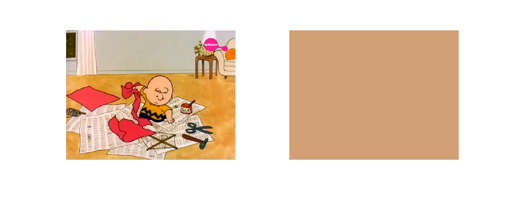
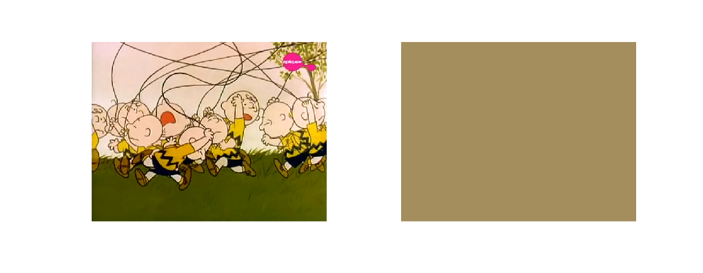
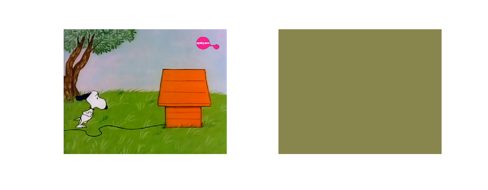
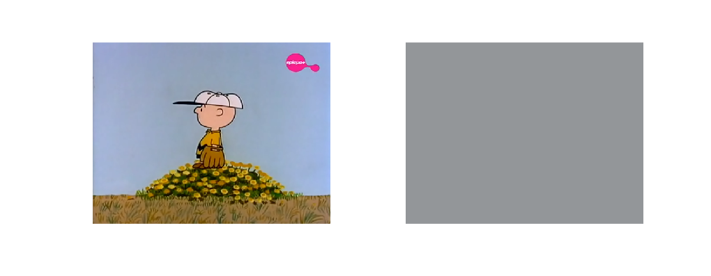
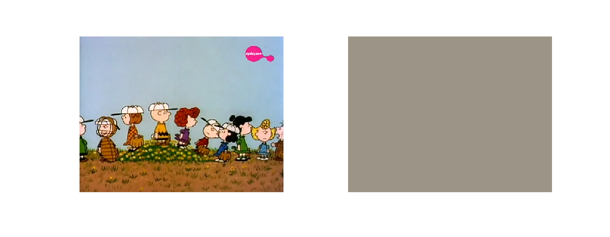
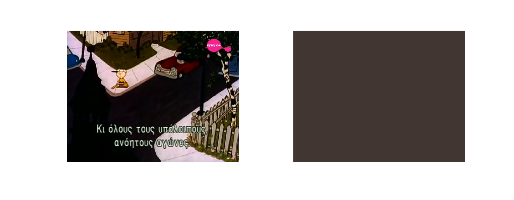
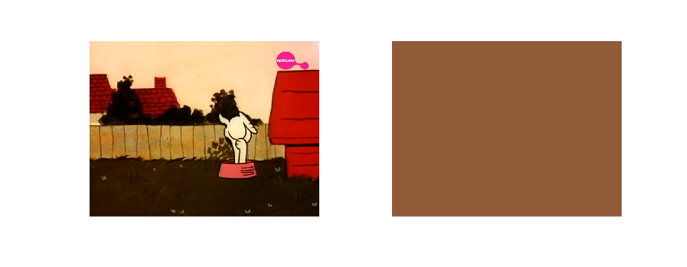
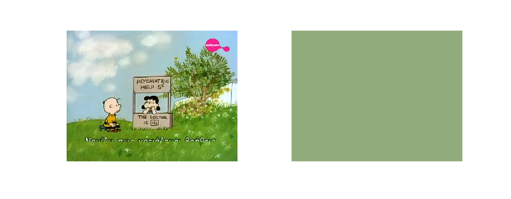
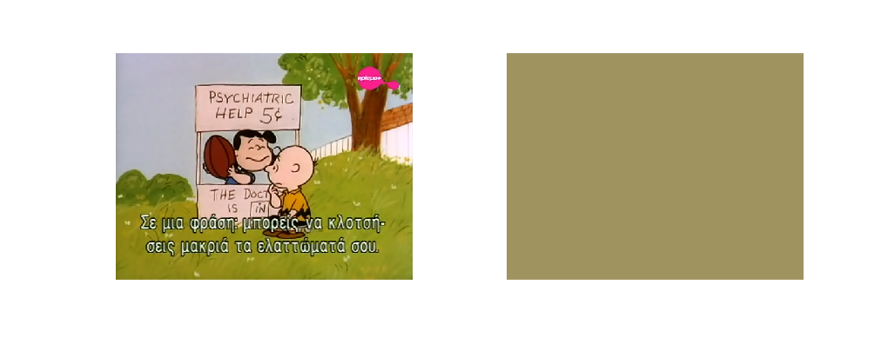
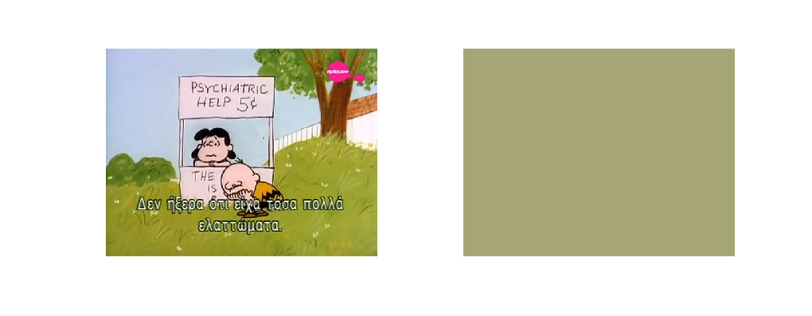
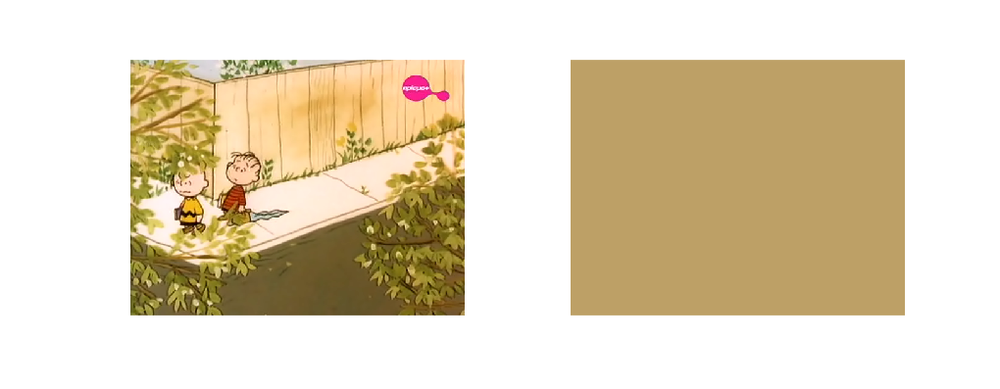
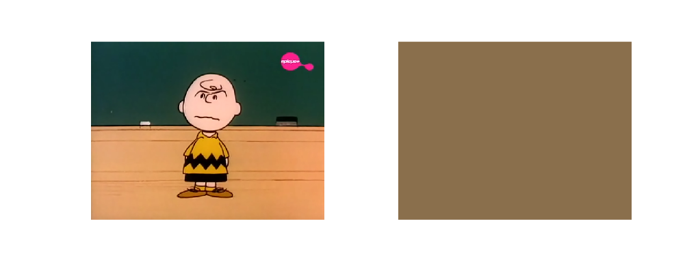
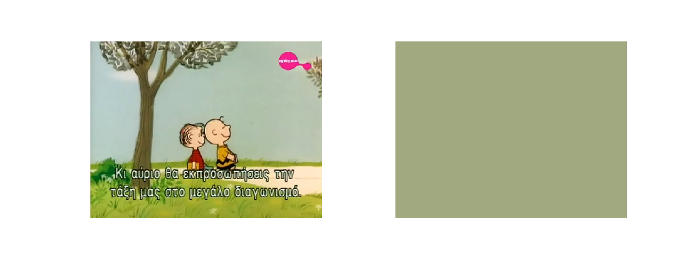

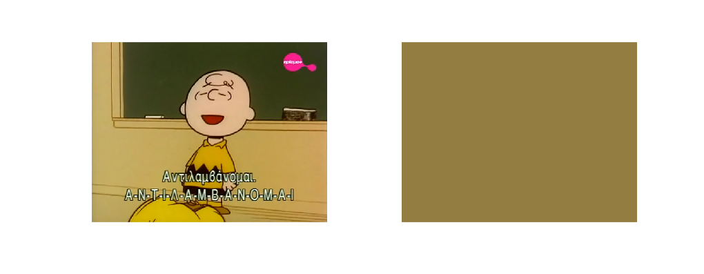
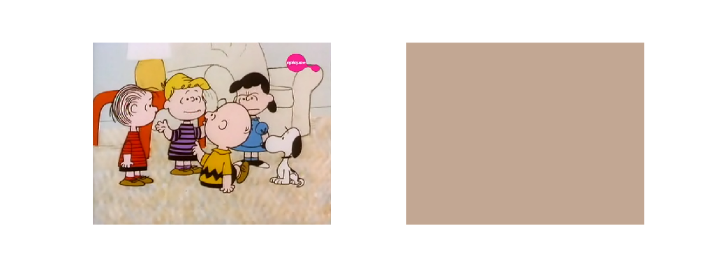
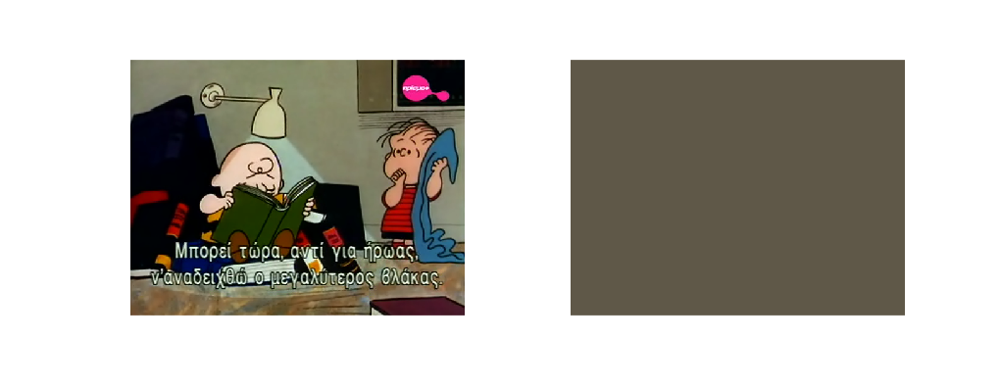

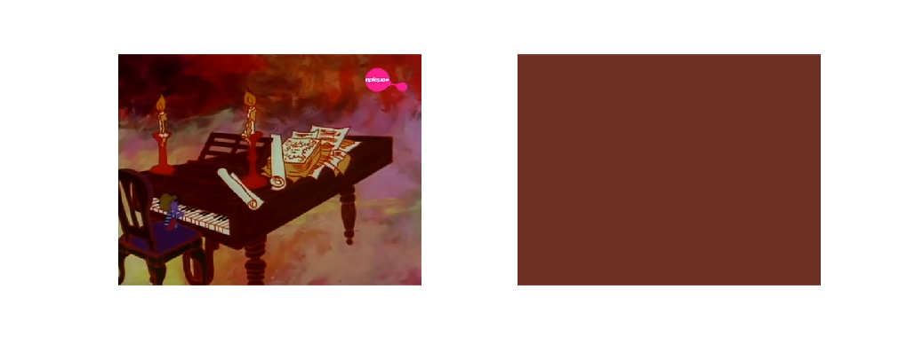


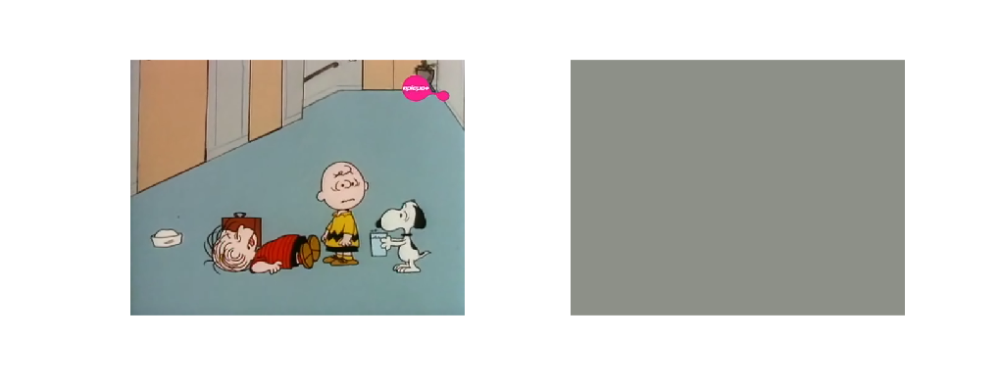
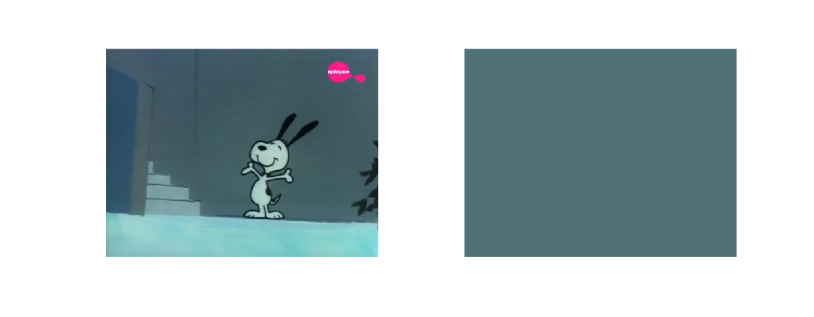

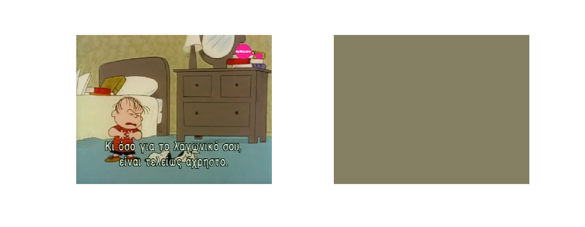
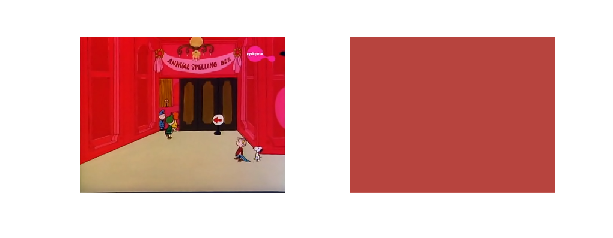
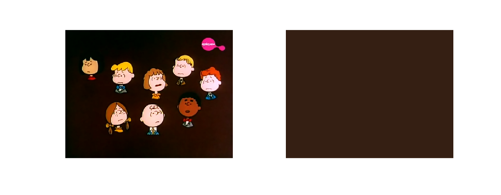
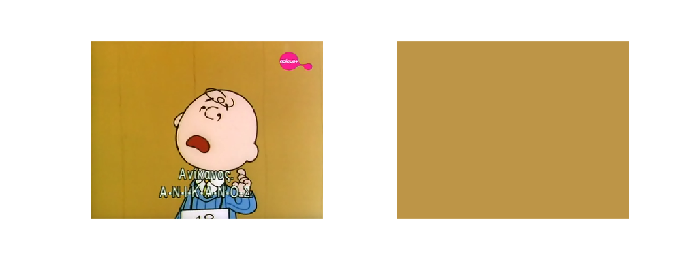

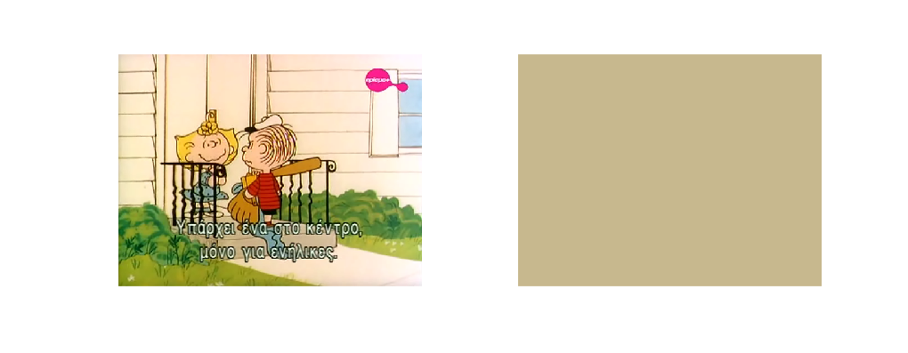
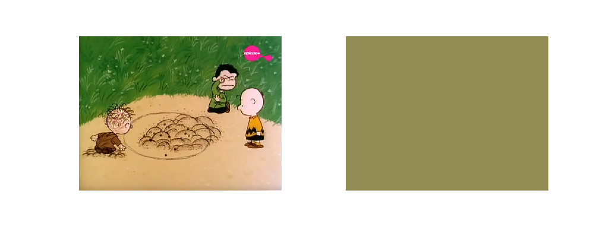


All these, give the following result!


